## Important Locations 

I made a shared google map of the important places: [https://goo.gl/maps/c9f62FGPppgYEN9cA](https://goo.gl/maps/c9f62FGPppgYEN9cA)

In particular, these are important addresses:

- [my address](https://goo.gl/maps/ZfEbgKadUhdBP9Fz9): Schilderhof 27, 1315 LS Almere
- [your hotel (Anno)](https://www.google.com/maps/place//data=!4m2!3m1!1s0x47c616e04f2df49d:0xb2bcf9100a88cd75?source=g.page.share) address: Grote Markt 121, 1315 JC Almere

You can get to Amsterdam from Almere by either going to Amsterdam Zuid, or Amsterdam Centraal. 

[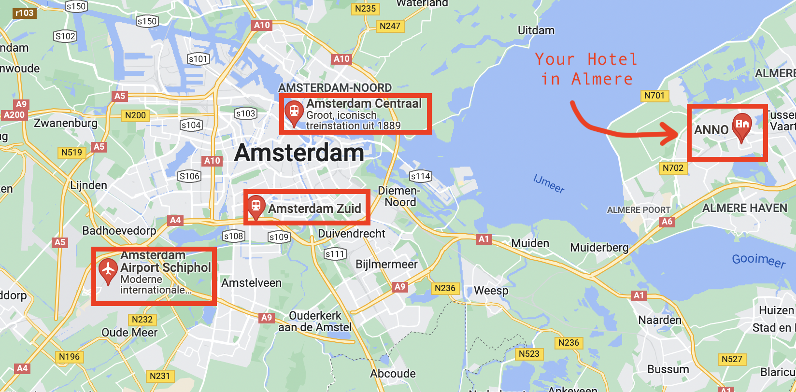](https://goo.gl/maps/c9f62FGPppgYEN9cA)

## The Day you Arrive

Immediately as you exit the arrivals gate at Schipol, you enter the Schipol Train Station. 

To buy a ticket card (called an "OV-Chipkaart") find one of the blue and yellow NS ticket machines. 

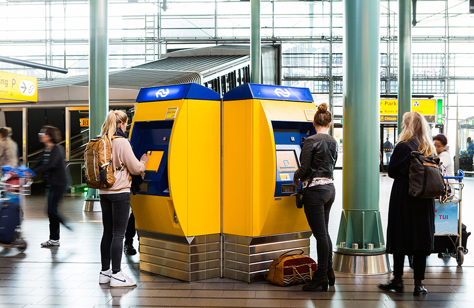

In the lower left hand corner, change the language to English, and then select "Other Products" from the ticket machine's home page.

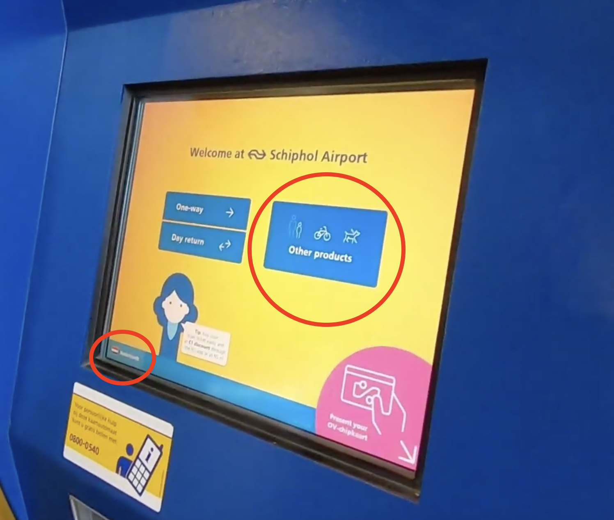

On the next page, select "Buy an OV Chipkaart"

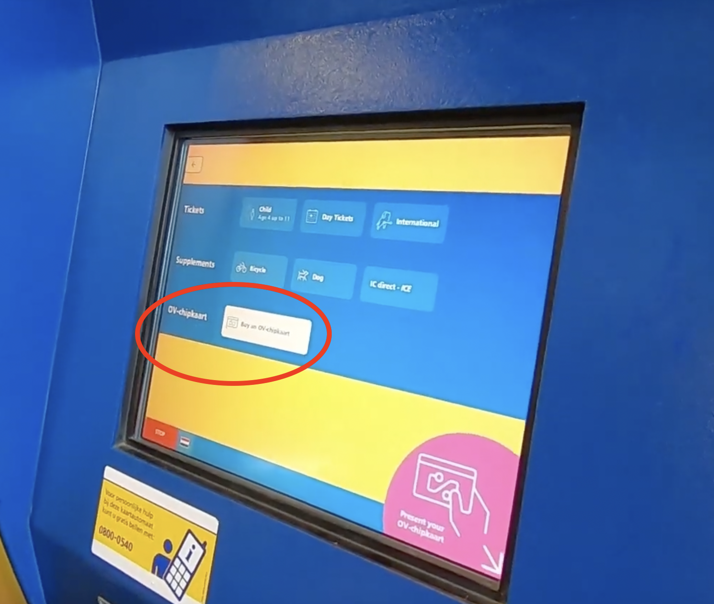

Then top up the card with 10 Euro (that's enough to get you from the Airport to your Hotel.)

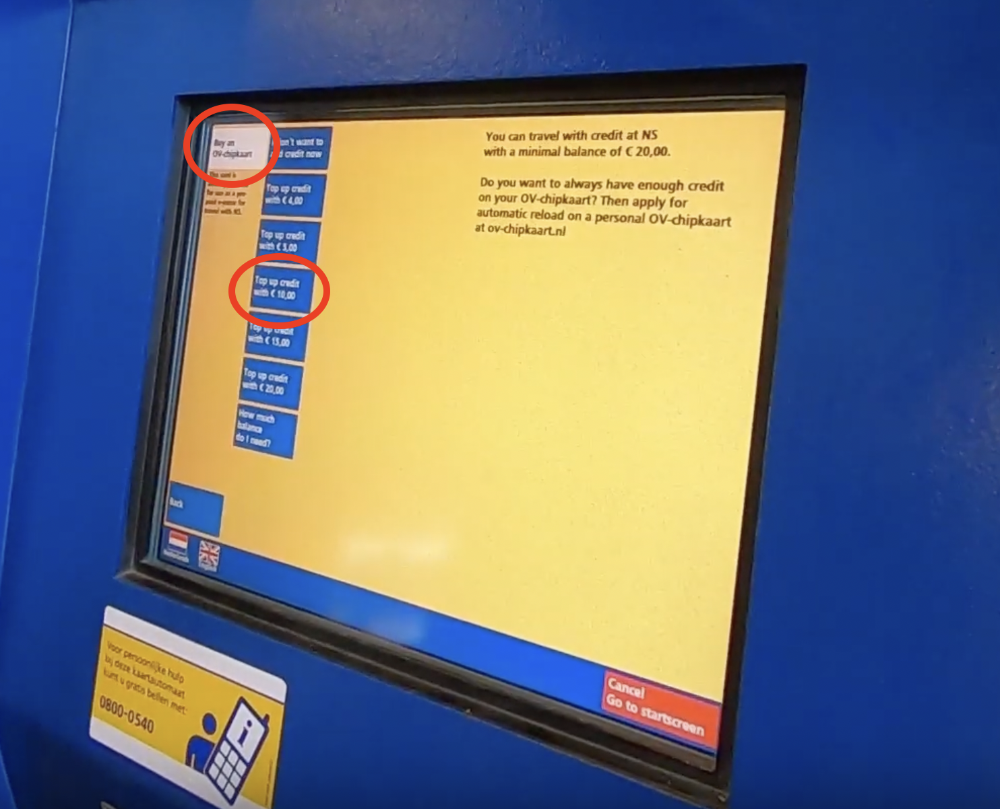

After you've topped up your card, find your train along with it's departure time and track.

Train schedules for the Schipol-Almere are on the tv screens in the station, the [NS transit website](https://www.ns.nl/en/journeyplanner/#/?vertrek=ChIJj0GtOCjhxUcRXSwObEbLcsE&vertrektype=poi&vertreklabel=Schiphol%20Airport&aankomst=Almere%20Centrum&aankomsttype=treinstation&type=vertrek), or in the [NS App](https://www.ns.nl/en/travel-information/ns-on-your-mobile/ns-app.html).  

In dutch, **tijd=time** and **spoor=track** they are pronounced "tide" and "spore".  Here's an example: board from Schipol on Tracks 1 or 2 at 6:05pm, and then arrive at Almere Centrum on Track 4.

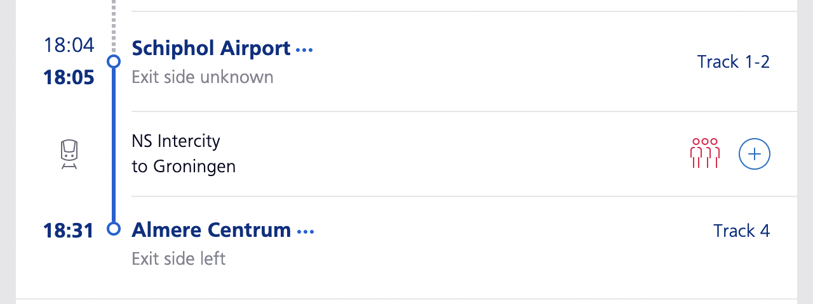

Note that some stations (like Amsterdam Centraal) have a spoor **letter** *and* **number**.  For example, spoor 1**b** may have a different train than spoor 1**a**. 

After you've found the correct train and you're ready to go to the platform, scan your OV-chipkaart at one of these terminals.

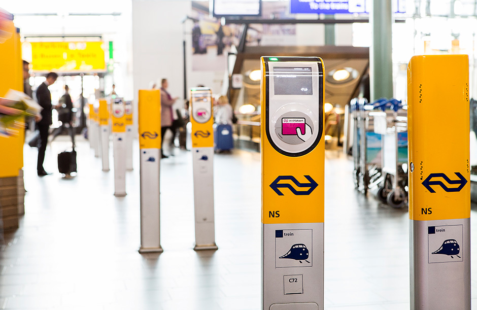

And then take the escalator down to the platform that matches your train's track number.

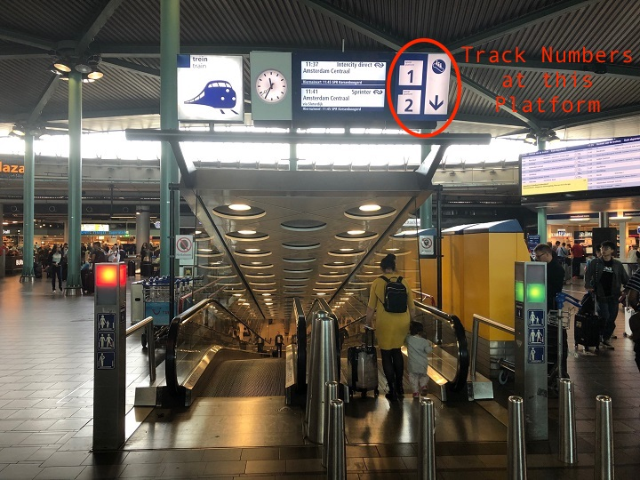

If you have any questions, you can message/call me on WhatsApp, or my dutch phone number +310682303406.

There are also information kiosks where people speak English. They look like this:

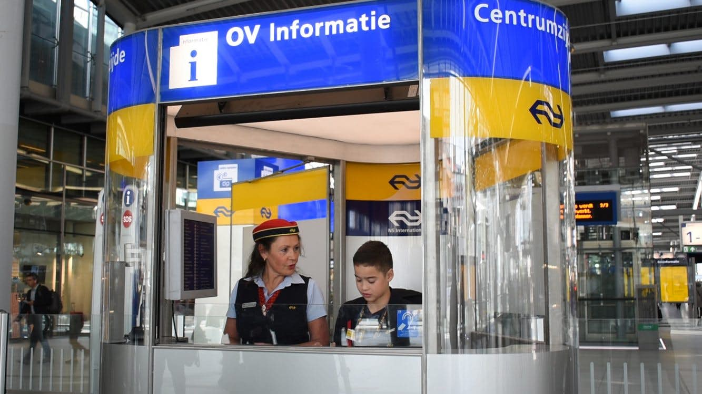

## Trains

### NS: The Intercity Transit System

**NS trains are the only way to get between <u>Schipol</u>, <u>Amsterdam</u>, and <u>Almere</u> with Public transport.** [NS](https://www.ns.nl/) trains are like CFR in Romania or MetroNorth in New York. There are two kinds of NS train: the *intercity*, and *sprinter*.  Both kinds of trains cost the same amount to ride, and they both stop at Almere and Amsterdam. 

These trains run on a schedule, usually once every 30 minutes. [Download the NS app](https://www.ns.nl/en/travel-information/ns-on-your-mobile/ns-app.html) to have your schedule with you so you don't miss your train! You can set the language in the app to English. You can also use [google maps](https://www.google.com/maps) to find directions by train.

**NS Intercity Trains**  are Express Trains with top speed of 140km/h or 90mph. These travel between Amsterdam, Schiphol and Almere.

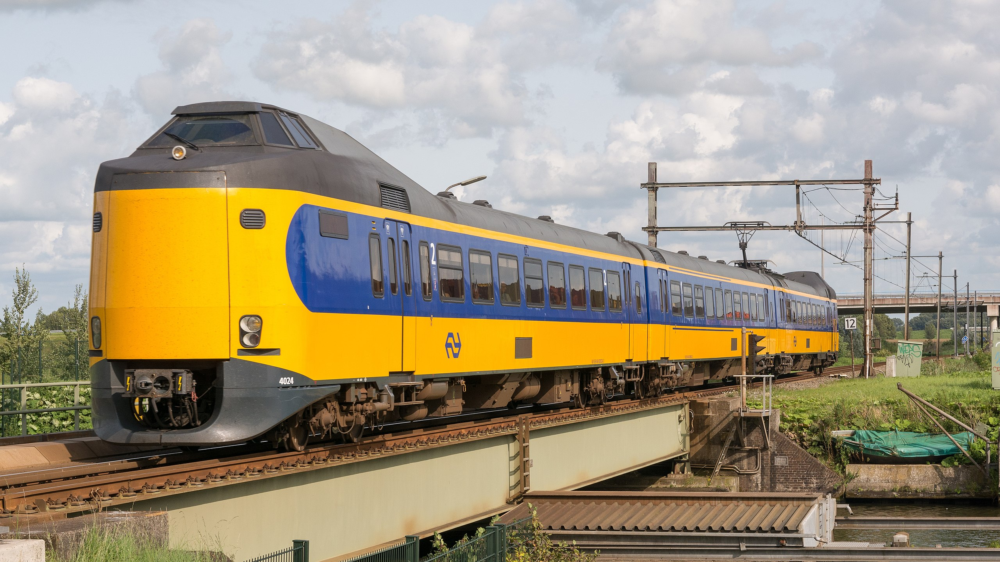

**NS Sprinter Train** are slow "local" trains that stop at smaller towns along the way to metropolitan train stations. These travel between Amsterdam, Schiphol and Almere.

### GVB: The Amsterdam-Only Transit System

**GVB is only for transit by metro/bus/tram inside of Amsterdam.** [GVB](https://www.gvb.nl/) has an  [iPhone App](https://apps.apple.com/nl/app/gvb-reis-app/id1544439867) and [Android App](https://play.google.com/store/apps/details?id=nl.gvb.reizigersapp&hl=en&gl=US) (you can set the language in the app to English) that provide directions and alerts, and you can also use [Google Maps](https://www.google.com/maps) to find directions.

The GVB is one way you can get around Amsterdam, if you don't have a bike. These trains only travel inside the city of Amsterdam. They look like this:

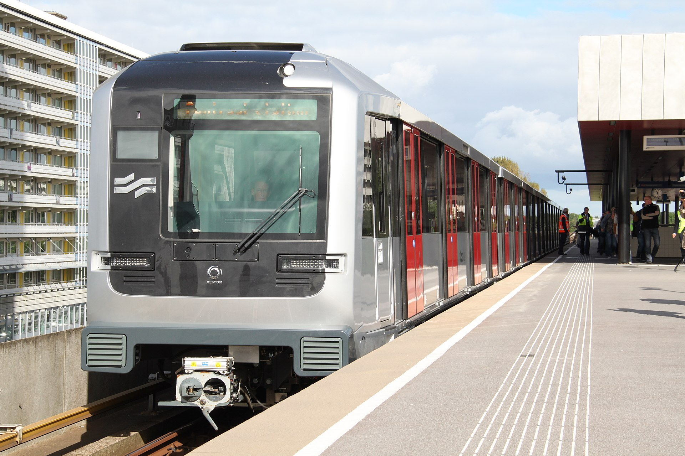

However, GVB also operates trams, that run on top of the street amongst cars, bikes, and pedestrians. With a GVB day pass, you can also board them. Trams have more routes in Amsterdam, and can sometimes get you closer to where you need to be than the Metro.  They look like this:

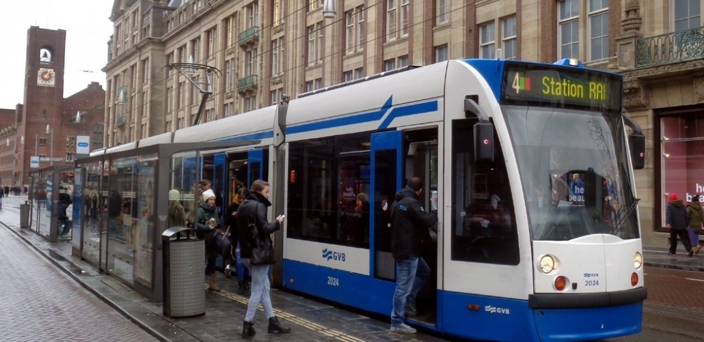

## Transit Costs

The transit costs here are made with the following assumption: that you'd spend 4 days in Amsterdam and 3 days in Almere. This is just an assumption, so this cost can change. Transit is expensive in NL, and so this is the cheapest package I could find. 

| Tickets                                                      | Ticket Costs | Subtotals |
| ------------------------------------------------------------ | ------------ | --------- |
| NS: Schipol - Almere (individual tickets)                    | 2 x €8.60    | €17.20    |
| NS: Amsterdam - Almere (individual tickets)                  | 4 x €6.70    | €26.80    |
| [GVB: 4-day Unlimited](https://webshop.gvb.nl/en_gb/daycard/) Tram/Metro/Buss Pass (package) | 1x € 25.50   | €25.50    |
| OV-Chipkaart (the transit card you use)                      | 1 x €7.50    | €7.50     |

**Total Transit Costs:**  € 77.00 per person 

## Bike Rental

There are plenty of [bike rental places in Amsterdam](https://www.iamsterdam.com/en/plan-your-trip/getting-around/rental/bike-hire). IMO it's the best way to get around the city; you see so much more than you could on foot. 

As with everything in Amsterdam, there's the issue of *expense*. Tourist rentals cost 10-20 euro per day. Locals (like me) can rent [OV-fiets](https://www.ns.nl/en/door-to-door/ov-fiets) for 4 euro per day, but we're limited to two rentals at a time. 

So, if you want to bike through Amsterdam we can do the following:

- In the morning, take the train together from Almere to the Amsterdam Zuid station. 
- Once there, I can use my ID to rent the first two bikes for you. (I'll need to leave you the ID for the day) 
- After this, I'll make my way to work. To get a third bike, you can go to the nearby [Black Bikes rental](https://black-bikes.com/bike/pedal-brake-bike/) ([google maps link](https://www.google.com/maps/place/Black+Bikes+Zuidas+%7C+Bike+Rental+Amsterdam/@52.3361533,4.8734681,17z/data=!3m1!4b1!4m5!3m4!1s0x47c60a0594b0b237:0x7c6a6b85d19ab270!8m2!3d52.3361533!4d4.8734681)). You need a passport and 50 euro cash deposit, or a credit card to rent bikes in Amsterdam.

## Flight Details

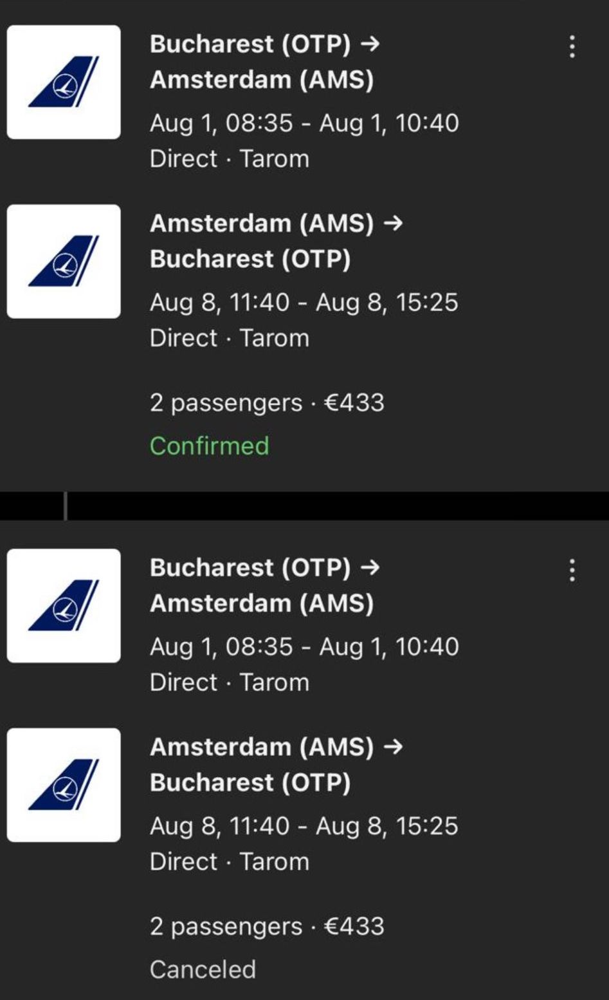
